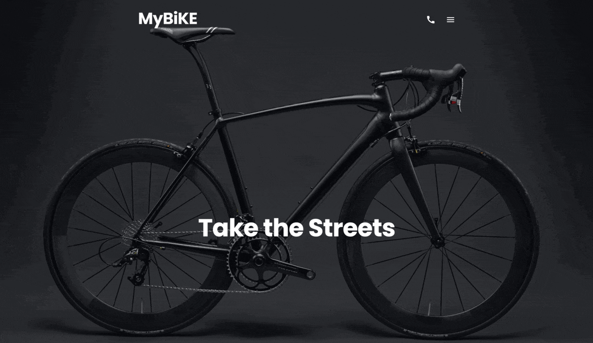

## Overview

### The challenge

Users should be able to:

- Visit website on different devices
- Navigate through website with links in navigation bar
- See animations and transitions to improve their experience

### Screenshot

### Links

- [Solution URL](https://github.com/Ostkreuzzz/BikeNow)
- [Live Site URL](https://ostkreuzzz.github.io/BikeNow/)

## My process

### Built with

- Semantic HTML5 markup
- CSS3: Grid, Flexbox
- BEM methodology: [BEM](https://en.bem.info/methodology/)
- Preprocessors: [Sass](https://sass-lang.com)
- Mobile-first workflow
- AOS library for animations

### What I learned

- Learned how to apply grid to the hole page
- How to structure my code by separating everything into its own file
- How to use most of the features of SASS (cycles, functions, mixins, etc.)

## Author

- Github - [Ostkreuzzz](https://github.com/Ostkreuzzz)
- LinkedIn - [Mykhailo Sulima](https://www.linkedin.com/in/mykhailo-sulima-a80648339/)
- Telegram - [@Ostkreuz](https://t.me/Ostkreuz)
